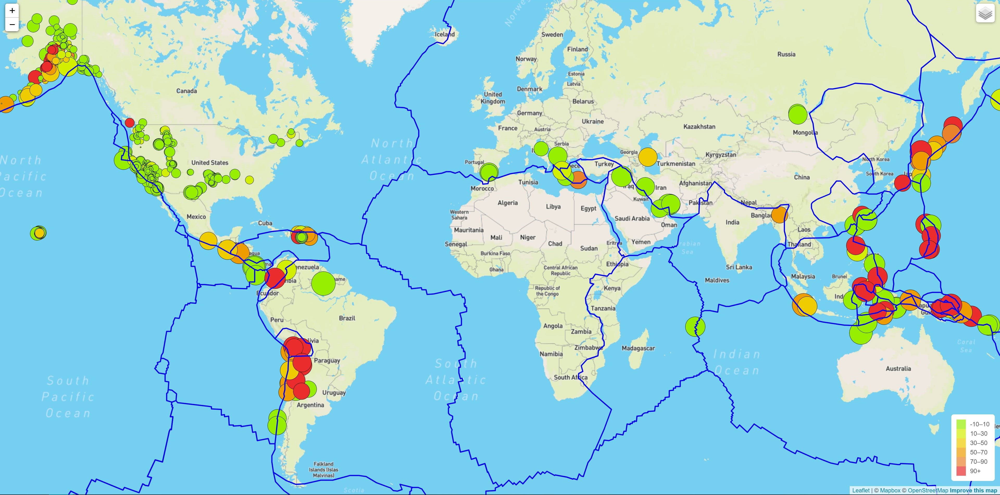
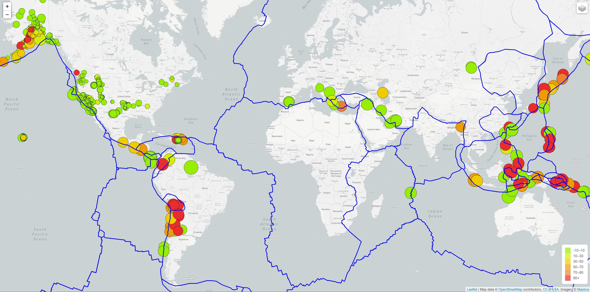

# Mapping Seismic Activity

## Background
The United States Geological Survey, or USGS, is responsible for providing scientific data about natural hazards, the health of our ecosystems and environment; and the impacts of climate and land-use change. Their scientists develop new methods and tools to supply timely, relevant, and useful information about the Earth and its processes. 

The USGS is interested in building a new set of tools that will allow them visualize their earthquake data. They collect a massive amount of data from all over the world each day, but they lack a meaningful way of displaying it. Their hope is that being able to visualize their data will allow them to better educate the public and other government organizations (and hopefully secure more funding) on issues facing our planet.

- - -

### Basic Visualization of Earthquakes
Your first task is to visualize the earthquake data set.
#### 1. Get your data set
   The USGS provides earthquake data in a number of different formats, updated in 5 minute increments. Visit the [USGS GeoJSON Feed](http://earthquake.usgs.gov/earthquakes/feed/v1.0/geojson.php) page. Click on the data set and capture the URL of the JSON representation provided. 
#### 2. Import & Visualize the Data
   Using Leaflet, create a map that plots all of the earthquakes by longitude and latitude.
   * Data markers should reflect:
      * magnitude of the earthquake by the size of the marker
      * depth of the earthquake by color of the marker
   * Popups provide additional information about the earthquake when a marker is clicked.
   * Provide context for your map data by creating a legend
   

- - -

### Tectonic Plates
The USGS wants to add a second additional data to the map to illustrate the relationship between tectonic plates and seismic activity. Data on tectonic plates can be found [here](https://github.com/fraxen/tectonicplates). You will need to pull in a second data set and visualize it along side your original set of data. 
   * Add data to the original map with the following:
      * Plot the tectonic plates on the map
      * Add a number of options for the base map to choose from as well as separate out our 
      * seperate the two data sets into overlays that can be turned on and off independently.
      * Add layer controls to our map.

- - -  
### Default Base Map overlayed with Tectonic Plate and Earthquakes layers

- - -
### Dark Base Map

- - -
### Light Base Map

- - -
### Satellite Base Map

- - -
### Tectonic Plate Overlay

- - -
### Earthquakes Overlay

